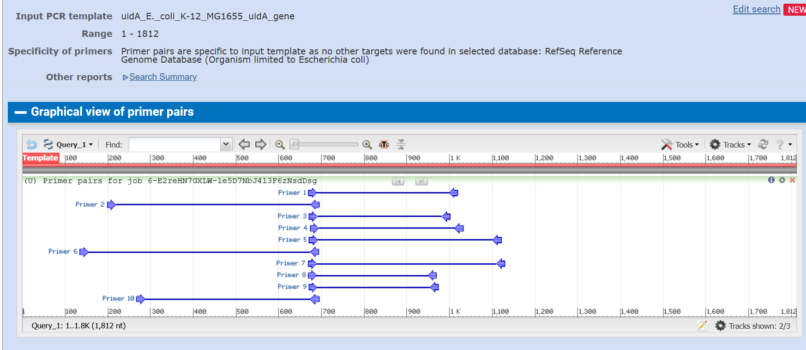
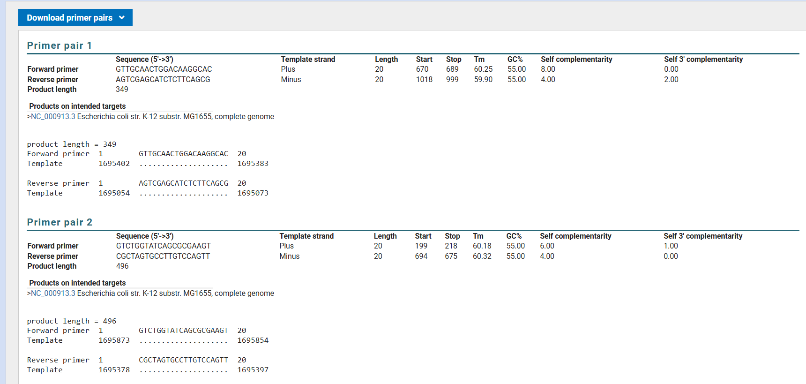
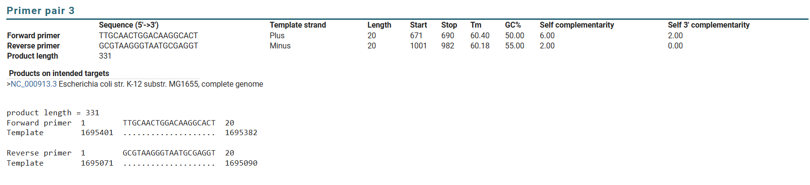
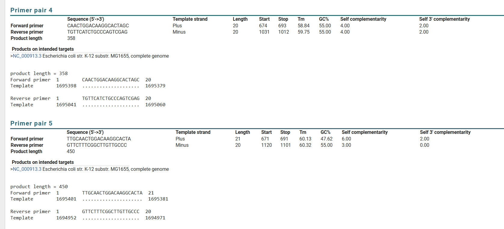
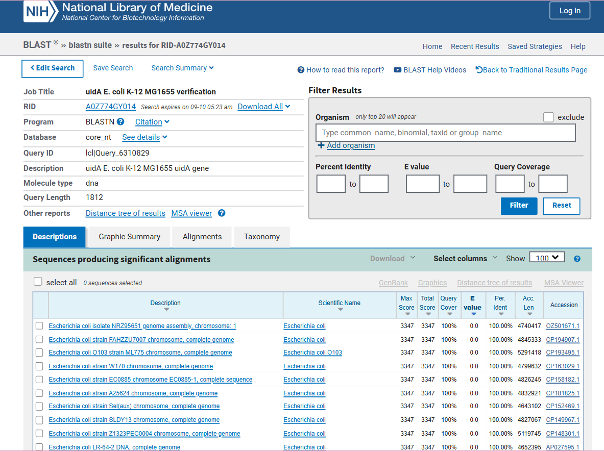
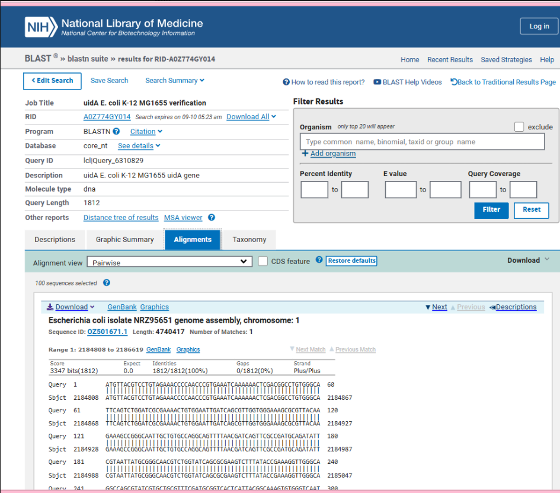
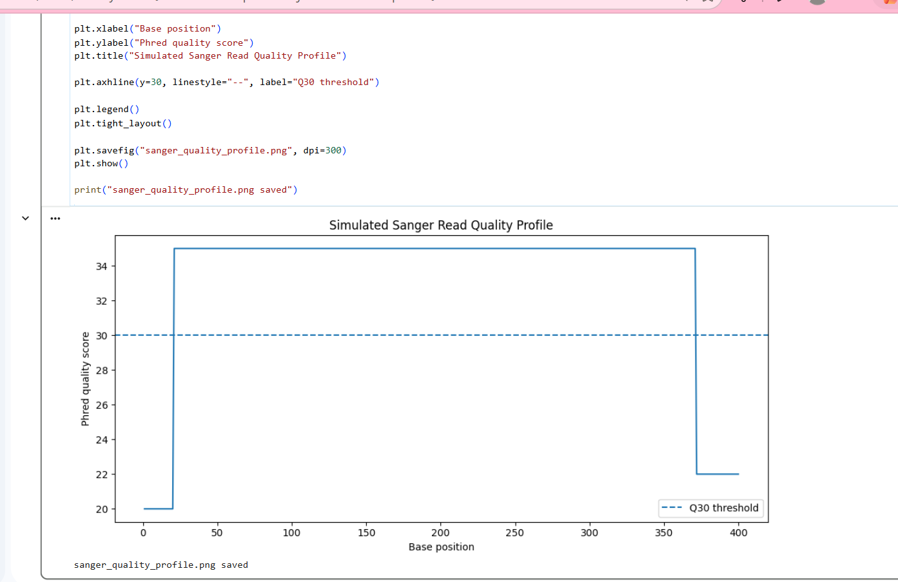

# PCR2Sequence: Molecular QC

**PCR design, sequence verification and molecular quality control using *Escherichia coli* uidA as a model target**

**Author:** Zeel Vaghela  
**Background:** MSc Bioinformatics (Distinction) | BSc Biotechnology  
**Tools:** Python | Jupyter Notebook | NCBI Primer-BLAST | NCBI BLAST

---

## Background

PCR does not really end when an expected product is obtained. The primers need to target the right region, the expected amplicon needs to represent the intended sequence, and sequencing results still need to be checked before interpretation.

I built this project to work through those checks computationally using **uidA from *Escherichia coli* K-12 MG1655** as a model target.

I started with the NCBI reference genome **NC_000913.3**, selected the uidA region, designed candidate primers and assessed them with Primer-BLAST. I then generated the expected amplicon and used BLAST and pairwise alignment to check its sequence identity. Finally, I used a simulated Sanger quality profile to look at sequence-level QC.

---

## 1. Target selection

I used the ***E. coli* K-12 MG1655** reference genome and selected **uidA** as the PCR target.

The target sequence was extracted from the reference and retained separately for the primer and sequence analysis. Keeping the reference, target and later amplicon sequences separate also made it easier to trace each stage of the work.

---

## 2. Primer design

I generated **five candidate primer pairs** around the uidA target.

I reviewed their position and orientation together with standard primer properties such as melting temperature, GC content and expected amplification.

The predicted primer positions are shown below.

This was my first check that the proposed primers were positioned around the region I actually wanted to investigate.

---

## 3. Primer specificity

I then used **NCBI Primer-BLAST** to examine the candidate primers.

I did not want to select a pair only because its basic primer properties looked suitable. Primer-BLAST gave me a way to look at predicted amplification and specificity as another part of the decision.

### Candidate pairs 1 and 2

### Candidate pair 3

### Candidate pairs 4 and 5

Looking across all five results allowed me to compare the candidates rather than relying on a single primer pair.

---

## 4. Predicted amplicon

After reviewing the primer results, I generated the sequence expected from amplification of the selected target region.

I saved the predicted amplicon separately and used this sequence as the query for the next stage of the analysis.

This was important because I wanted to check the predicted product independently rather than simply assuming that it represented the intended uidA sequence.

---

## 5. BLAST sequence verification

I submitted the predicted amplicon to **NCBI BLAST** to investigate its sequence identity.

The BLAST search supported the expected relationship between the predicted amplicon and the intended *E. coli* target.

I then looked directly at the pairwise sequence alignment.

Looking at the alignment itself was useful because it allowed me to inspect how the query corresponded to the matching sequence instead of relying only on the BLAST summary.

---

## 6. Sequence quality

For the final stage, I wanted to include the type of QC question that becomes important once sequence data are available.

I therefore generated a **simulated Sanger sequencing quality profile**.

I used the profile to look at how sequence confidence can vary across a read and why lower-quality regions may need to be reviewed or trimmed before alignment or further interpretation.

The Sanger quality profile in this project is **simulated for sequence-QC practice**. It is not experimentally generated sequencing data.

---

## 7. Python analysis

I used **Python and Jupyter Notebook** for the sequence-processing part of the project.

The notebook keeps the analysis in a step-by-step format so that the sequence handling and checks can be followed. I also kept a Python script as a reusable version of the computational work.

The repository includes the reference and target sequences, predicted amplicon, primer outputs, analysis code and the figures used above.

---

## What I worked with

- PCR primer design and interpretation
- NCBI reference sequence data
- Primer-BLAST
- NCBI BLAST
- Pairwise sequence alignment
- FASTA sequence handling
- Python
- Jupyter Notebook
- Sequence quality assessment
- Sanger QC concepts

---

## Why I built this project

During my **BSc Biotechnology**, I gained practical experience with DNA isolation, PCR and gel electrophoresis. My **MSc Bioinformatics** then moved me further into computational analysis of biological data.

I wanted to build something that connected those two parts of my training instead of presenting my wet-lab and bioinformatics experience separately.

Using one target from primer design through predicted amplification, BLAST verification and sequence QC gave me a practical way to make that connection.

---

**Zeel Vaghela**  
MSc Bioinformatics (Distinction), Teesside University  
BSc Biotechnology, Gujarat University
